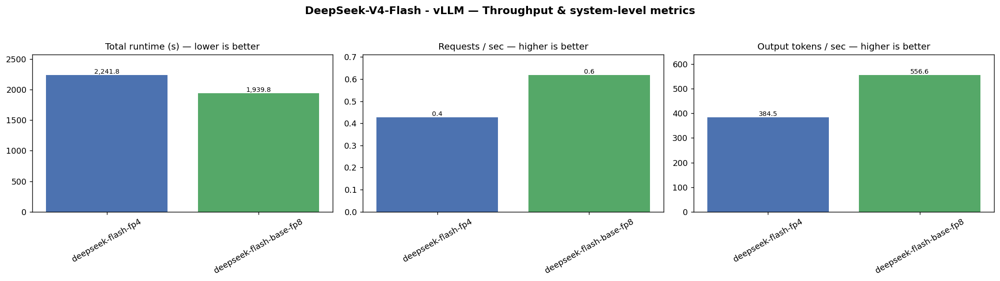
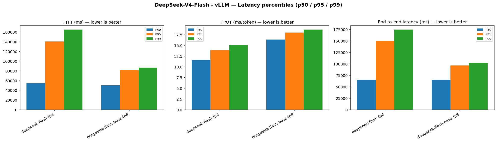
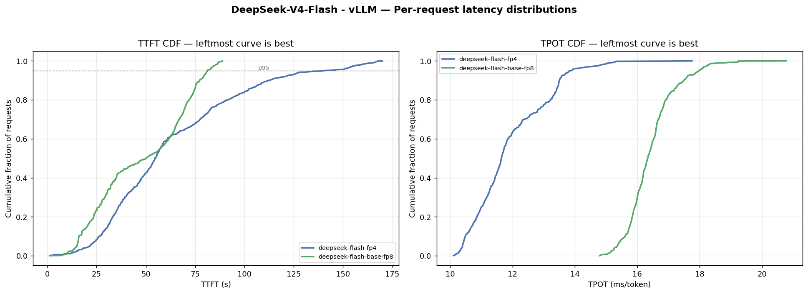
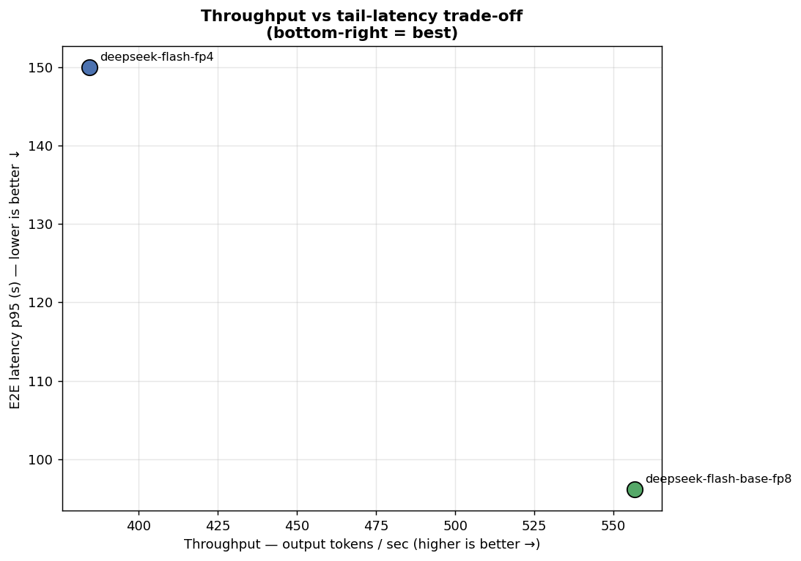

# DeepSeek-V4-Flash — Báo cáo benchmark vLLM (10/06/2026)

So sánh hai biến thể model **DeepSeek-V4-Flash** trên cùng stack serving **vLLM disaggregated** (1 prefill + 1 decode, KV transfer qua NixlConnector) trên hạ tầng DGX-H200.

## Cấu hình so sánh

Hai run dùng **cùng cấu hình phần cứng và topology serving**; chỉ khác biến thể model weights.

| Thuộc tính | `deepseek-flash-fp4` | `deepseek-flash-base-fp8` |
|---|---|---|
| Model weights | `DeepSeek-V4-Flash` | `DeepSeek-V4-Flash-Base` |
| Serving | Disaggregated **1P1D** | Disaggregated **1P1D** |
| Parallelism | Prefill **TP=8**, Decode **TP=8** | Prefill **TP=8**, Decode **TP=8** |
| Quantization | FP8 weights + FP8 KV cache | FP8 weights + FP8 KV cache |
| Backend / KV | vLLM v0.22.0 · Native (Nixl) | vLLM v0.22.0 · Native (Nixl) |
| Run ID | `20260610T075958` | `20260611T015457` |

---

## 1. Báo cáo khách quan

### 1.1 Băng thông (throughput)

| Chỉ số | `deepseek-flash-fp4` | `deepseek-flash-base-fp8` | Chênh lệch (base so với fp4) |
|---|---:|---:|---|
| Requests hoàn thành | 958 | 1 200 | +25,3% |
| Runtime (s) | 2 241,8 | 1 939,8 | **−13,5%** (nhanh hơn) |
| RPS | 0,427 | 0,619 | **+45,0%** |
| Output tok/s | 384,5 | 556,6 | **+44,8%** |

> Run `deepseek-flash-fp4` chỉ hoàn tất **958/1 200** request (15/40 conversation); run `deepseek-flash-base-fp8` hoàn tất đủ **1 200/1 200** request. Chênh lệch throughput cần được đọc kèm mức hoàn thành này.

### 1.2 Độ trễ — Time to First Token (TTFT)

| Percentile | `deepseek-flash-fp4` (ms) | `deepseek-flash-base-fp8` (ms) | Chênh lệch (base so với fp4) |
|---:|---:|---:|---|
| mean | 63 426 | 48 037 | **−24,3%** |
| p50 | 54 661 | 50 063 | **−8,4%** |
| p95 | 140 487 | 81 205 | **−42,2%** |
| p99 | 164 997 | 86 596 | **−47,5%** |

### 1.3 Độ trễ — Time Per Output Token (TPOT)

| Percentile | `deepseek-flash-fp4` (ms/tok) | `deepseek-flash-base-fp8` (ms/tok) | fp4 nhanh hơn base |
|---:|---:|---:|---|
| mean | 11,92 | 16,44 | **−27,5%** TPOT |
| p50 | 11,64 | 16,34 | **−28,8%** TPOT |
| p95 | 13,86 | 17,97 | **−22,9%** TPOT |
| p99 | 15,11 | 18,68 | **−19,1%** TPOT |

### 1.4 Độ trễ — End-to-end (E2E)

| Percentile | `deepseek-flash-fp4` (ms) | `deepseek-flash-base-fp8` (ms) | Chênh lệch (base so với fp4) |
|---:|---:|---:|---|
| mean | 74 138 | 62 813 | **−15,3%** |
| p50 | 65 312 | 65 087 | ≈ **−0,3%** (tương đương) |
| p95 | 150 012 | 96 121 | **−35,9%** |
| p99 | 174 348 | 101 474 | **−41,8%** |

Phân phối per-request: `base-fp8` thắng rõ ở TTFT (CDF dịch trái), `fp4` thắng ở TPOT (CDF dịch trái).

Trên biểu đồ throughput vs E2E p95, `deepseek-flash-base-fp8` nằm ở vùng throughput cao hơn ~45% đồng thời tail latency thấp hơn ~36%.

---

## 2. Phân tích và nhận xét

Vì hai run chia sẻ cùng stack **disagg 1P1D, TP=8** trên cả prefill và decode, mọi khác biệt đo được chủ yếu phản ánh **ảnh hưởng của biến thể model** (`Flash` vs `Flash-Base`), không phải thay đổi topology hay phân bổ GPU.

### Ảnh hưởng lên băng thông

`DeepSeek-V4-Flash-Base` cho throughput hệ thống cao hơn rõ rệt: runtime ngắn hơn 13,5%, RPS và output tok/s cao hơn ~45%. Tuy nhiên, run `Flash` không hoàn thành đủ workload (958/1 200 request), nên các chỉ số throughput của fp4 phản ánh cả khả năng chịu tải kém hơn dưới cùng điều kiện serving.

### Ảnh hưởng lên TTFT

`Flash-Base` có TTFT thấp hơn ở mọi percentile, đặc biệt tail (p95 −42%, p99 −48%). Điều này cho thấy prefill path của Base ổn định hơn: ít request bị xếp hàng lâu trước token đầu tiên. Với `Flash`, TTFT p95/p99 cao gấp ~1,7–1,9 lần, khớp với hình ảnh hệ thống quá tải một phần (timeout, backlog prefill).

### Ảnh hưởng lên TPOT

`Flash` decode nhanh hơn **19–29%** mỗi output token so với `Flash-Base` trên mọi percentile — đây là lợi thế rõ nhất của variant Flash: kernel decode được tối ưu cho tốc độ generate. Tuy nhiên, lợi thế TPOT không đủ bù TTFT cao và mức hoàn thành thấp hơn.

### Ảnh hưởng lên E2E

E2E p50 gần như bằng nhau (~65 s) vì phần lớn thời gian là generate 900 output token — TPOT chiếm ưu thế ở median. Khác biệt xuất hiện rõ ở tail: `Flash-Base` giảm E2E p95/p99 **36–42%**, phản ánh TTFT tail thấp hơn và hệ thống ổn định hơn. Profile tổng thể trên cùng cấu hình serving: **Flash-Base thắng ở responsiveness và ổn định**, **Flash thắng ở tốc độ decode per-token**.

### Hạn chế so sánh

Mức hoàn thành request khác nhau (958 vs 1 200) là yếu tố duy nhất ngoài model variant có thể làm méo so sánh throughput và tail latency của run `Flash`. Cần rerun fp4 đến khi hoàn tất đủ 1 200 request để khẳng định chênh lệch băng thông.

---

## 3. Khuyến nghị

| Mục tiêu | Khuyến nghị |
|---|---|
| Throughput tổng thể & hoàn thành workload | **`deepseek-flash-base-fp8`** (`Flash-Base`) — output tok/s cao hơn ~45%, hoàn tất 100% request |
| TTFT / phản hồi đầu, đặc biệt tail | **`deepseek-flash-base-fp8`** — TTFT p95 thấp hơn ~42% |
| E2E tail latency (p95/p99) | **`deepseek-flash-base-fp8`** — E2E p95 thấp hơn ~36% |
| Tốc độ generate từng token (TPOT) | **`deepseek-flash-fp4`** (`Flash`) — nhanh hơn ~23–29% mỗi output token |
| Độ tin cậy dưới tải cao | **`deepseek-flash-base-fp8`** — không bị timeout một phần như fp4 |

**Tóm lại:** Trên cùng cấu hình **disagg 1P1D, TP=8**, **`DeepSeek-V4-Flash-Base`** cho kết quả serving tổng thể tốt hơn: băng thông cao hơn, tail latency thấp hơn, và hoàn thành đủ workload. Variant **`DeepSeek-V4-Flash`** có lợi thế decode per-token (~23–29% TPOT) nhưng prefill chậm hơn và khả năng chịu tải kém hơn khiến throughput thực tế và độ ổn định thua kém.

**Bước tiếp theo đề xuất:**

1. Rerun `deepseek-flash-fp4` (hoặc tăng timeout) để hoàn tất đủ 1 200 request, xác nhận chênh lệch throughput trên cùng stack.
2. Sweep concurrency (10/20/40 client) trên cả hai model variant để xác định điểm saturation.
3. Đo chất lượng output (accuracy/perplexity) nếu cần quyết định deploy dựa trên cả hiệu năng lẫn chất lượng.

---

## Tài liệu tham chiếu

- Cấu hình phân tích: [`configs/deepseek-flash-10062026.json`](../../configs/deepseek-flash-10062026.json)
- Metrics tổng hợp: [`summary.json`](summary.json)
- Dữ liệu thô: `deepseek-v4-flash/10062026-result/{20260610T075958,20260611T015457}/perf/`
