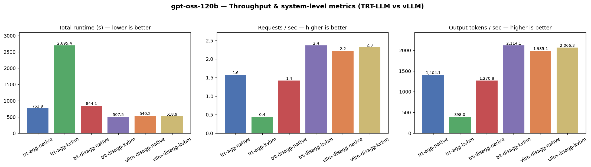
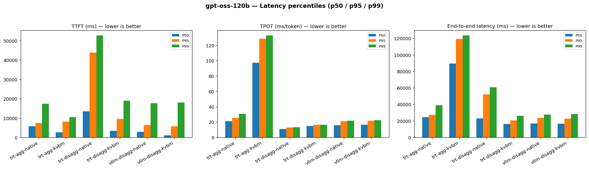
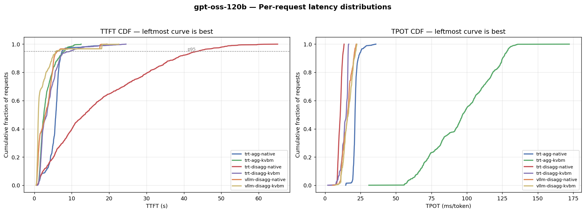
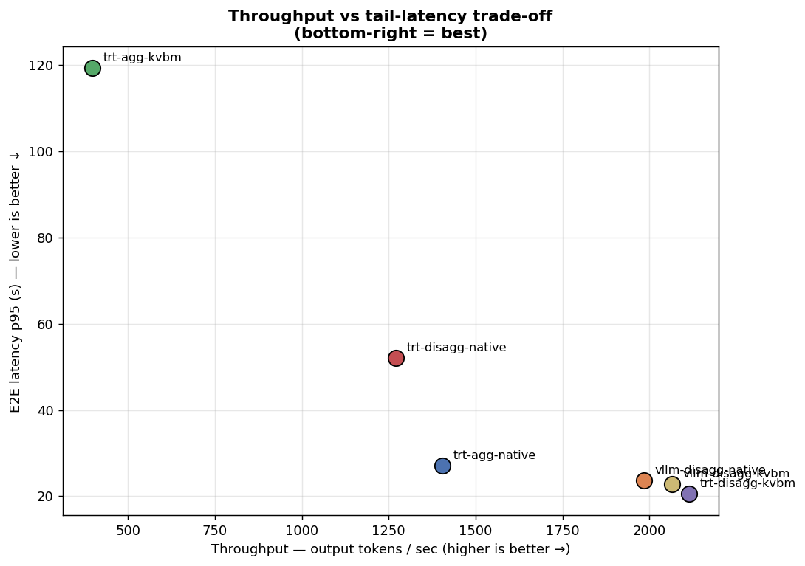

# gpt-oss-120b — Tổng hợp & Phân tích Benchmark (TRT-LLM vs vLLM)

**Nguồn dữ liệu:** `gpt-oss-120b/03062026-result` · **Ngày:** 2026-06-03
**Đã loại trừ:** `agg-trtllm-native`

---

## 1. Bối cảnh: workload giống hệt nhau ⇒ so sánh công bằng

Cả 6 cấu hình chạy **cùng một dataset**, nên mọi khác biệt đến từ backend/kiến trúc serving chứ không phải từ tải:

| Tham số | Giá trị |
|---|---|
| Model | gpt-oss-120b |
| Số request | 1.200 |
| Clients đồng thời | 40 |
| Lượt/hội thoại (trung bình) | ~30 (1–59) |
| Input tokens (trung bình) | ~72.500 |
| Output tokens (trung bình) | ~894 |
| KV cache hit | 93,6% |

Các cấu hình trải trên 3 trục: **Backend** (TRT-LLM vs vLLM) × **Serving** (Aggregated vs Disaggregated) × **KV manager** (Native vs KVBM).

---

## 2. Bảng tổng hợp

| Config | Backend | Serving | KV mgr | Runtime(s) | RPS | Out tok/s | TTFT p50 | TTFT p95 | TTFT p99 | TPOT mean | TPOT p95 | E2E p50 | E2E p95 |
|---|---|---|---|---|---|---|---|---|---|---|---|---|---|
| trt-agg-native | TRT-LLM | Aggregated | Native | 763,9 | 1,571 | 1.404 | 5.755 | 7.458 | 17.413 | 21,5 | 25,3 | 24.607 | 27.129 |
| trt-agg-kvbm | TRT-LLM | Aggregated | KVBM | **2.695,4** | **0,445** | **398** | 2.554 | 8.115 | 10.519 | **96,5** | **128,4** | **89.367** | **119.322** |
| trt-disagg-native | TRT-LLM | Disaggregated | Native | 844,1 | 1,422 | 1.271 | **13.474** | **43.878** | **52.686** | 10,6 | 12,9 | 23.011 | 52.111 |
| **trt-disagg-kvbm** | TRT-LLM | Disaggregated | KVBM | **507,5** | **2,364** | **2.114** | 3.351 | 9.606 | 18.957 | 14,0 | 16,3 | 16.334 | 20.538 |
| vllm-disagg-native | vLLM | Disaggregated | Native | 540,2 | 2,222 | 1.985 | 2.937 | 6.381 | 17.600 | 15,7 | 20,9 | 16.852 | 23.675 |
| **vllm-disagg-kvbm** | vLLM | Disaggregated | KVBM | 518,9 | 2,312 | 2.066 | **1.081** | **5.800** | 18.092 | 16,3 | 21,7 | 16.677 | 22.806 |

*(đơn vị ms trừ khi ghi rõ; **đậm** = tốt nhất / tệ nhất của cột)*

---

## 3. Biểu đồ

### 3.1. Throughput & chỉ số hệ thống

### 3.2. Latency theo percentile (p50 / p95 / p99)

### 3.3. Phân phối per-request (CDF của TTFT & TPOT)

### 3.4. Đánh đổi Throughput ↔ Tail-latency (Pareto)

---

## 4. Insight chính

1. **🏆 Top tier rất sát nhau — `trt-disagg-kvbm`, `vllm-disagg-kvbm`, `vllm-disagg-native`.** Cả ba đều đạt ~2.000–2.100 tok/s và E2E p95 ~20–24s. TRT-LLM+KVBM nhỉnh nhất về throughput thô (2.114 tok/s) và E2E p95 thấp nhất (20,5s); hai cấu hình vLLM bám rất sát.

2. **⚡ vLLM thắng rõ về TTFT (độ trễ phản hồi đầu tiên).** `vllm-disagg-kvbm` có TTFT p50 chỉ **1,08s** và p95 **5,8s** — tốt nhất toàn bảng. Cả hai cấu hình vLLM đều cho TTFT p95 ~6s, thấp hơn đáng kể so với `trt-disagg-kvbm` (~9,6s). → vLLM cho trải nghiệm "phản hồi tức thì" tốt hơn.

3. **💥 `trt-agg-kvbm` vẫn là thảm họa — đừng dùng.** Chậm nhất mọi mặt: runtime 2.695s (>5×), TPOT trung bình 96,5 ms/token (~6–9× chậm hơn), E2E p95 ~119s. KVBM ghép với serving *aggregated* của TRT-LLM gây nghẽn nghiêm trọng ở giai đoạn decode (đường xanh lá tách hẳn sang phải trong CDF của TPOT).

4. **🔧 KVBM cực kỳ quan trọng với TRT-LLM disagg, nhưng chỉ "thêm thắt" với vLLM:**
   - **TRT-LLM disagg**, native→KVBM: cải thiện vượt bậc — throughput +66% (1.271→2.114 tok/s), TTFT p95 sụp đổ từ **43,9s → 9,6s**. KVBM *bắt buộc* để TRT-LLM disagg dùng được.
   - **vLLM disagg**, native→KVBM: chỉ nhích nhẹ — throughput +4% (1.985→2.066 tok/s), TTFT p50 cải thiện (2,9s→1,1s). vLLM đã tốt sẵn ngay cả với Native KV.

5. **🛠️ vLLM disaggregated trưởng thành/ổn định hơn TRT-LLM disaggregated.** `trt-disagg-native` có TTFT cực tệ và biến động lớn (p95 ~44s, đường đỏ trải dài trong TTFT CDF) — dấu hiệu nghẽn ở khâu prefill / điều phối KV giữa prefill ↔ decode workers. `vllm-disagg-native` *không* gặp vấn đề này (TTFT p95 chỉ 6,4s). Nói cách khác, điểm yếu mà TRT-LLM phải nhờ KVBM khắc phục thì vLLM đã xử lý tốt ngay từ bản native.

6. **Đánh đổi TTFT ↔ TPOT.** TRT-LLM disagg cho TPOT thấp hơn một chút (14 vs 16 ms) nhưng vLLM bù lại bằng TTFT thấp hơn nhiều. Aggregated (`trt-agg-native`) cho TTFT ổn định nhưng throughput thấp và TPOT cao hơn → kém cạnh tranh so với nhóm disaggregated.

---

## 5. Khuyến nghị

- ✅ **Ưu tiên TTFT / trải nghiệm tương tác → `vllm-disagg-kvbm`** (TTFT p50 ~1s, throughput ~2.066 tok/s).
- ✅ **Ưu tiên throughput thô / E2E latency thấp nhất → `trt-disagg-kvbm`** (2.114 tok/s, E2E p95 20,5s).
- ✅ **`vllm-disagg-native`** là lựa chọn vận hành đơn giản, mạnh mẽ nếu không muốn bật KVBM — vẫn nằm trong nhóm tốt nhất.
- ⚠️ Với **TRT-LLM disaggregated, bắt buộc bật KVBM**; bản native có TTFT không chấp nhận được.
- ❌ **Tránh `trt-agg-kvbm`** — phản tác dụng nghiêm trọng.

---

## 6. File trong thư mục này (`analysis/`)

| File | Mô tả |
|---|---|
| `OVERVIEW.md` | Tài liệu này |
| `analyze.py` | Script tính toán & vẽ biểu đồ (tái lập được) |
| `summary.json` | Số liệu thô đã tính |
| `images/plot_throughput.png` | Runtime / RPS / output tok/s |
| `images/plot_latency_percentiles.png` | TTFT / TPOT / E2E theo p50·p95·p99 |
| `images/plot_distributions.png` | CDF của TTFT & TPOT (xem rõ phần đuôi) |
| `images/plot_tradeoff.png` | Scatter throughput vs tail-latency (Pareto) |

> Tái lập: `cd analysis && python3 analyze.py`
